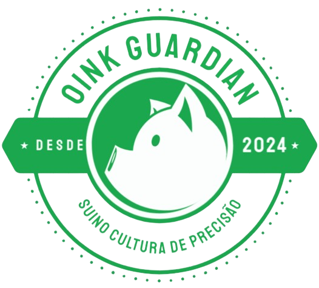

# OinkGuardian

  

O OinkGuardian é uma plataforma desenvolvida para suinocultores, com o objetivo de otimizar a gestão das operações diárias, proporcionando maior controle e eficiência na criação de suínos. Através de tecnologias como IoT e inteligência artificial, o OinkGuardian oferece recursos avançados para monitoramento, análise e notificação, contribuindo para o aumento da produtividade e a redução de custos na suinocultura.

## Funcionalidades Principais

1. **Monitoramento Avançado:**
   - Inserção de câmeras para acompanhar o ambiente dos suínos.
   - Ajuste na configuração das câmeras para garantir uma visão precisa.
   - Visualização da temperatura atual da granja para monitoramento do ambiente.

2. **Gestão de Carregamentos:**
   - Registro de carregamentos de suínos para manter um histórico organizado.
   - Possibilidade de ajuste nos registros de carregamento para correções ou atualizações.
   - Início e fim de carregamento por botões, proporcionando controle preciso das operações.

3. **Análise e Relatórios:**
   - Geração de relatórios detalhados sobre os carregamentos para análise da eficiência operacional.
   - Criação de gráficos de carregamento por hora para entender padrões de atividade.
   - Visualização de indicadores do último e penúltimo carregamento para acompanhar o histórico recente das atividades.

4. **Suporte e Notificações:**
   - Suporte ao usuário para esclarecimento de dúvidas e assistência técnica.
   - Capacidade de deletar carregamentos e câmeras para manter o sistema organizado.
   - Recebimento de notificações sobre falhas em carregamentos e conclusão de carregamentos para tomada de medidas rápidas.

